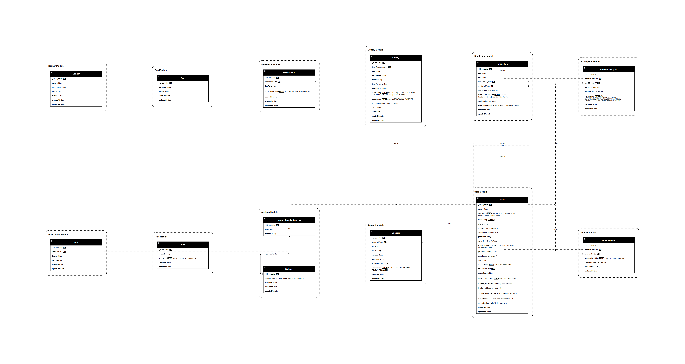

# Gift Box Backend API

## Overview

Gift Box Backend API is the backend service behind a lottery and gift-box event platform. It handles the core operations of the system, including user authentication, lottery management participant registration, winner announcements, push notifications, real-time communication, and background task processing.

Built with Node.js, Express, TypeScript, and MongoDB, the backend uses Socket.IO for real-time updates, Firebase Cloud Messaging (FCM) for push notifications, and BullMQ with Redis to process background jobs efficiently.

## Design Reference

The backend APIs in this project were developed based on the approved UI/UX design.

| Resource     | Link                                                                                                                               |
| ------------ | ---------------------------------------------------------------------------------------------------------------------------------- |
| Figma Design | [Click Here](https://www.figma.com/design/fdHi4cQB55RxffOE58F51L/jamallbk-%7C%7C-Giftbox-app?node-id=1-2&p=f&t=RrO9l9wqALWJOxxV-0) |

> The UI/UX design was provided by the project team and is referenced here to help understand the API flow and business requirements.

## Features

- **User Authentication & Authorization**: Local authentication via JWT access and refresh tokens, social login support (Google OAuth 2.0, Facebook, Firebase ID tokens), and Role-Based Access Control (RBAC).
- **Lottery & Contest Management**: Create, update, and manage lottery events, rules, banners, and winner selections.
- **Participant Tracking**: Event registration, participant verification, and activity logging.
- **Real-Time Communication**: WebSocket-based messaging and chat channels powered by Socket.IO.
- **Push & Email Notifications**: Firebase Cloud Messaging (FCM) integration for push notifications and Nodemailer for transactional email delivery.
- **SMS Integration**: Phone number verification and notifications via Twilio API.
- **Background Jobs & Queues**: Asynchronous background queue processing for emails, notifications, and scheduled events using BullMQ and Redis, with real-time queue management via Bull-Board.
- **Scheduled Tasks**: Cron job execution using `node-cron`.
- **File Uploads**: File storage and static asset serving for user avatars, banners, and attachments via Multer.
- **Logging & Auditing**: Structured file-rotating logging with Winston and HTTP access logging via Morgan.

## Tech Stack

| Category                | Technology                                       |
| ----------------------- | ------------------------------------------------ |
| Runtime                 | Node.js                                          |
| Language                | TypeScript                                       |
| Framework               | Express.js                                       |
| Database                | MongoDB                                          |
| ODM                     | Mongoose                                         |
| Authentication          | JWT, Passport (Google, Facebook), Firebase Admin |
| Validation              | Zod                                              |
| Real-Time Communication | Socket.IO                                        |
| Cache & Queue           | Redis, ioredis, BullMQ                           |
| Queue Dashboard         | Bull-Board                                       |
| Task Scheduling         | Node-Cron                                        |
| SMS Provider            | Twilio                                           |
| Push Notifications      | Firebase Cloud Messaging (FCM)                   |
| Email Provider          | Nodemailer                                       |
| File Storage            | Multer (Local Disk Storage)                      |
| Logging                 | Winston (Daily Rotate File), Morgan              |
| Templating Engine       | EJS                                              |

## Project Structure

```
src/
├── DB/                  # Database initialization and admin account seeding
├── app/                 # Core application components
│   ├── builder/         # Query builder utilities (search, filter, pagination)
│   ├── middlewares/     # Express middleware functions (auth, error handler, uploads)
│   ├── modules/         # Business domain modules (controllers, services, routes, models)
│   └── routes/          # API route aggregators (v1 and v2 route definitions)
├── config/              # Centralized environment & service configurations
├── constants/           # Global application constants
├── enums/               # TypeScript enumerations (roles, status, gender)
├── errors/              # Custom error handling classes
├── handlers/            # Dedicated event handlers and listeners
├── helpers/             # Utility helpers (JWT, Socket.IO, Email, Pagination)
├── queues/              # BullMQ background job queues and background workers
├── shared/              # Shared logging configurations (Winston, Morgan)
├── types/               # TypeScript type extensions and declarations
├── util/                # Miscellaneous helper utilities
├── app.ts               # Express application initialization and middleware binding
└── server.ts            # Application entry point, database connection, and server startup
```

### Directory Responsibilities

- **`src/app/modules/`**: Contains modular business domains. Each module includes models, interfaces, controllers, services, routes, and validation schemas.
- **`src/app/middlewares/`**: Implements global security, request validation, authentication, and error interception.
- **`src/config/`**: Loads environment configuration parameters and initializes third-party integrations (Firebase, Redis, BullMQ).
- **`src/queues/`**: Manages asynchronous worker threads and BullMQ message queues for notifications, emails, and cron jobs.
- **`src/helpers/`**: Contains helper modules for socket connections, JWT token generation, pagination logic, and mail delivery.

## Installation

### Prerequisites

Ensure you have the following installed on your system:

- **Node.js**: `>= 18.x`
- **MongoDB**: `>= 6.0` (local instance or MongoDB Atlas)
- **Redis**: `>= 7.0` (required for BullMQ queue operations)
- **Package Manager**: `npm`

### Step-by-Step Setup

1. **Clone the repository:**

   ```bash
   git clone <repository-url>
   cd jamallbk-backend
   ```

2. **Install project dependencies:**

   ```bash
   npm install
   ```

3. **Configure Environment Variables:**
   Create a `.env` file in the root directory and populate it with the required configuration parameters.

4. **Start Redis Server:**
   You can start Redis using Docker Compose:

   ```bash
   docker-compose up -d
   ```

5. **Start the Development Server:**
   ```bash
   npm run dev
   ```

## Environment Variables

The application requires the following environment variables defined in `.env`:

| Variable                 | Required | Description                                                       |
| ------------------------ | -------- | ----------------------------------------------------------------- |
| `IP`                     | No       | IP address binding for the HTTP server                            |
| `PORT`                   | Yes      | Port number on which the HTTP server listens                      |
| `DATABASE_URL`           | Yes      | MongoDB connection string URI                                     |
| `NODE_ENV`               | Yes      | Deployment environment mode (`development`, `production`, `test`) |
| `BCRYPT_SALT_ROUNDS`     | Yes      | Salt rounds used for password hashing                             |
| `JWT_SECRET`             | Yes      | Secret key used for signing JWT access tokens                     |
| `JWT_EXPIRE_IN`          | Yes      | Expiration time for JWT access tokens                             |
| `JWT_REFRESH_SECRET`     | Yes      | Secret key used for signing JWT refresh tokens                    |
| `JWT_REFRESH_EXPIRES_IN` | Yes      | Expiration time for JWT refresh tokens                            |
| `REDIS_HOST`             | Yes      | Hostname of the Redis server                                      |
| `REDIS_PORT`             | Yes      | Port number of the Redis server                                   |
| `REDIS_PASSWORD`         | No       | Authentication password for the Redis server                      |
| `REDIS_DB`               | No       | Redis database index number                                       |
| `START_CRON`             | No       | Flag to enable or disable background scheduled cron tasks         |
| `CLIENT_URL`             | Yes      | Origin URL of the frontend web application                        |
| `BASE_URL`               | Yes      | Base URL of this backend API service                              |
| `DASHBOARD_URL`          | No       | URL of the admin management dashboard                             |
| `FIREBASE_CLIENT_EMAIL`  | Yes      | Firebase Admin SDK client email                                   |
| `FIREBASE_PRIVATE_KEY`   | Yes      | Firebase Admin SDK private key                                    |
| `FIREBASE_PROJECT_ID`    | Yes      | Firebase project ID                                               |
| `EMAIL_FROM`             | Yes      | Sender email address for outgoing emails                          |
| `EMAIL_USER`             | Yes      | SMTP authentication username                                      |
| `EMAIL_PORT`             | Yes      | SMTP connection port                                              |
| `EMAIL_HOST`             | Yes      | SMTP server hostname                                              |
| `EMAIL_PASS`             | Yes      | SMTP authentication password                                      |
| `SUPPORT_RECEIVER_EMAIL` | Yes      | Destination email for user support queries                        |
| `ADMIN_EMAIL`            | Yes      | Email address for seeding the default Super Admin user            |
| `ADMIN_PASSWORD`         | Yes      | Password for seeding the default Super Admin user                 |
| `TWILIO_ACCOUNT_SID`     | Yes      | Twilio account SID                                                |
| `TWILIO_AUTH_TOKEN`      | Yes      | Twilio authentication token                                       |
| `TWILIO_SERVICE_SID`     | Yes      | Twilio verification service SID                                   |

## Available Scripts

| Script   | Command                                                | Description                                                                   |
| -------- | ------------------------------------------------------ | ----------------------------------------------------------------------------- |
| `dev`    | `ts-node-dev --respawn --transpile-only src/server.ts` | Starts the server in development mode with automatic hot reloading.           |
| `start`  | `node dist/server.js`                                  | Runs the compiled JavaScript application in production mode.                  |
| `build`  | `tsc`                                                  | Compiles TypeScript source files into JavaScript inside the `dist` directory. |
| `format` | `prettier . --write`                                   | Formats codebase using Prettier.                                              |

## Database

- **Database System**: MongoDB
- **Object Data Modeling (ODM)**: Mongoose (v8.6.1)
- **Database Connection**: Managed asynchronously in `src/server.ts` via `mongoose.connect()`.
- **Database Seeding**: Built-in seeding function (`seedSuperAdmin()`) automatically verifies and creates the default `SUPER_ADMIN` user account on server start if one does not exist.
- **Migration Strategy**: Schemas are managed directly through Mongoose models; standalone migration files are not configured.

## Entity Relationship Diagram (ERD)

The project includes automatically generated Entity Relationship Diagrams (ERDs) mapping the Mongoose schemas and relationships across modules.

#### System-Wide ER Diagram

Below is the rendered project-wide database structure:



#### Module-Specific Diagrams

For a focused view of each module, check the following directories:

- **User:** [PNG](./docs/erd/modules/user/er-diagram.png)
- **Banner:** [PNG](./docs/erd/modules/banner/er-diagram.png)
- **Breaks:** [PNG](./docs/erd/modules/breaks/er-diagram.png)
- **Chat:** [PNG](./docs/erd/modules/chat/er-diagram.png)
- **FAQ:** [PNG](./docs/erd/modules/faq/er-diagram.png)
- **FCM Token:** [PNG](./docs/erd/modules/fcmToken/er-diagram.png)
- **Focus Session:** [PNG](./docs/erd/modules/focusSession/er-diagram.png)
- **Friends:** [PNG](./docs/erd/modules/friends/er-diagram.png)
- **Message:** [PNG](./docs/erd/modules/message/er-diagram.png)
- **Modes:** [PNG](./docs/erd/modules/modes/er-diagram.png)
- **Notification:** [PNG](./docs/erd/modules/notification/er-diagram.png)
- **Personal Reminder:** [PNG](./docs/erd/modules/personalReminder/er-diagram.png)
- **Registered Device:** [PNG](./docs/erd/modules/registeredDevice/er-diagram.png)
- **ResetToken:** [PNG](./docs/erd/modules/resetToken/er-diagram.png)
- **Rule:** [PNG](./docs/erd/modules/rule/er-diagram.png)
- **Settings:** [PNG](./docs/erd/modules/settings/er-diagram.png)
- **Support:** [PNG](./docs/erd/modules/support/er-diagram.png)

## Authentication & Authorization

- **JWT Authentication**: Secured endpoints require a Bearer token passed in the `Authorization` header. Tokens are verified via custom JWT middleware.
- **Social & Third-Party Auth**: Supports Google OAuth 2.0, Facebook authentication via Passport, and Firebase ID token verification.
- **Password Security**: Passwords are hashed using `bcrypt` prior to database storage.
- **Role-Based Access Control (RBAC)**: User privileges are governed by predefined role definitions:
  - `SUPER_ADMIN`: Full administrative control across all system modules.
  - `ADMIN`: Administrative capabilities for managing users, lotteries, and support requests.
  - `USER`: Regular client role with access to participation, profile, and chat features.

## Modules

The application consists of the following 17 business modules:

- **Analytics**: Aggregates platform statistics and system metrics.
- **Auth**: Manages user authentication, social logins, password resets, and token refreshes.
- **Banner**: Handles promotional banners and media display assets.
- **Chat**: Provides real-time messaging, chat rooms, and conversation logs.
- **FAQ**: Manages frequently asked questions and answers.
- **FCM Token**: Stores and updates Firebase Cloud Messaging tokens for device push notifications.
- **Lottery**: Manages lottery creation, schedules, prize pools, and status updates.
- **Message**: Controls individual chat message storage and retrieval.
- **Notification**: Manages user notification preferences, history, and status.
- **Participant**: Tracks user entries and registrations for lottery events.
- **Reset Token**: Manages password reset tokens and verification state.
- **Rule**: Manages system terms, conditions, and participation rules.
- **Settings**: Provides global app configuration settings and preferences.
- **Support**: Handles user support requests, feedback, and inquiry dispatches.
- **Twilio Service**: Integrates phone number verification and SMS capabilities.
- **User**: Manages user profiles, roles, avatars, and status updates.
- **Winner**: Declares, tracks, and manages lottery contest winners.

## Running the Project

### Development Mode

Run the server with live reloading:

```bash
npm run dev
```

### Build for Production

Compile TypeScript files to JavaScript:

```bash
npm run build
```

### Production Mode

Run the compiled production server:

```bash
npm run start
```

### Code Formatting

Format source code according to Prettier rules:

```bash
npm run format
```

## Logging

Logging is handled through a structured logging system:

- **Winston Logger**: Writes structured application logs with daily file rotation (`winston-daily-rotate-file`) into separate files for error logs and success logs.
- **Morgan HTTP Logger**: Captures HTTP request metadata, status codes, and execution times for incoming API calls.

## Error Handling

The application implements a centralized error handling strategy:

- **Global Error Handler**: Middleware (`globalErrorHandler`) captures unhandled operational errors, Zod validation errors, and Mongoose database errors, returning structured JSON error responses.
- **Process Protection**: Listens to `uncaughtException` and `unhandledRejection` process signals to log error trace information and perform graceful server shutdown.

## Security

- **CORS Protection**: Origin-restricted Cross-Origin Resource Sharing with credential support.
- **Rate Limiting**: Request rate limiting via `express-rate-limit` to prevent brute-force attacks and abuse.
- **Password Hashing**: Secure password hashing via `bcrypt`.
- **Request Validation**: Schema-based payload validation on routes using `Zod`.
- **Role-Based Authorization**: Route guards restricting unauthorized user actions based on defined RBAC roles.

## License

ISC

## Developer

Moshfiqur Rahman - moshfiqurrahman37@gmail.com
